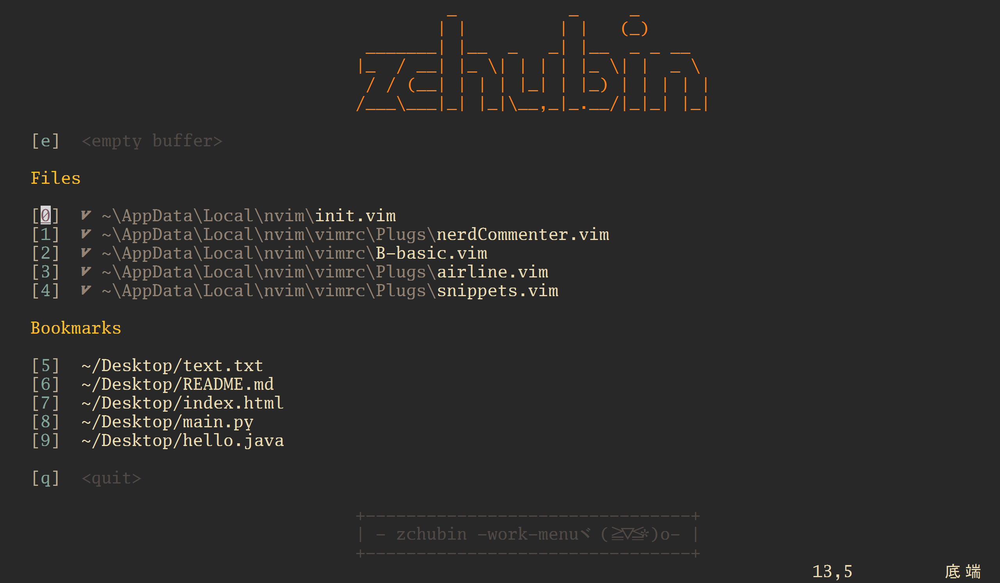
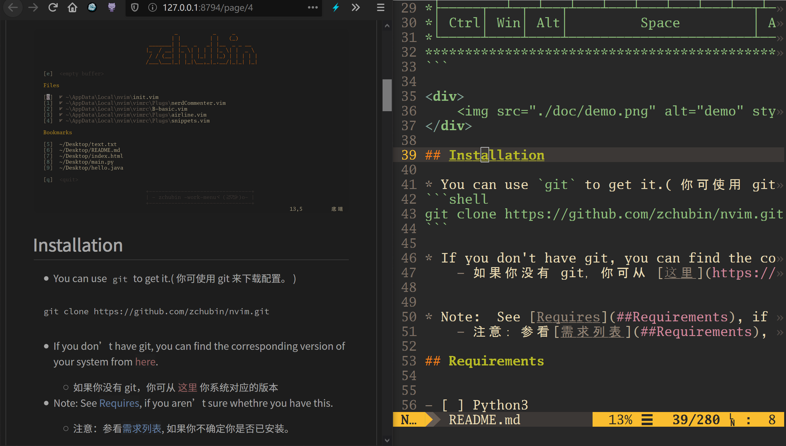
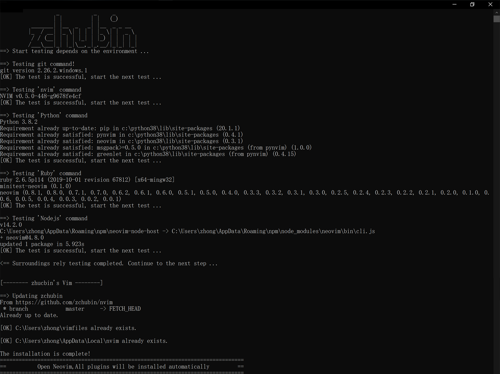

# Neovim Configuration

* [**Documentation(官方文档)**](https://neovim.io/doc)
    - [*个人理解文档(新手文档*)](./doc/Vim.md)
----
* This is a Neovim configuration for ~~newbies~~ mainly on **Windows10**.
    - 这是一个新手主要在 windows10 上的 Neovim 配置。
* I have limited expressive power,but your understanding is outstanding
    - 你的理解能力肯定比我的写得好。
* Please don't download **without reading this document**.
    - 请不要只下载而不读本文档。

* This is my keyboard layout
    - 这是我的键盘布局(没什么特别的(╯▽╰ ))

```txt
************************************************************************************************
* ┌───┐   ┌───┬───┬───┬───┐ ┌───┬───┬───┬───┐ ┌───┬───┬───┬───┐ ┌───┬───┬───┐                  *
* │Esc│   │ F1│ F2│ F3│ F4│ │ F5│ F6│ F7│ F8│ │ F9│F10│F11│F12│ │P/S│S L│P/B│  ┌┐    ┌┐    ┌┐  *
* └───┘   └───┴───┴───┴───┘ └───┴───┴───┴───┘ └───┴───┴───┴───┘ └───┴───┴───┘  └┘    └┘    └┘  *
*┌───┬───┬───┬───┬───┬───┬───┬───┬───┬───┬───┬───┬───┬───────┐ ┌───┬───┬───┐ ┌───┬───┬───┬───┐ *
*│~ `│! 1│@ 2│# 3│$ 4│% 5│^ 6│& 7│* 8│( 9│) 0│_ -│+ =│ BacSp │ │Ins│Hom│PUp│ │N L│ / │ * │ - │ *
*├───┴─┬─┴─┬─┴─┬─┴─┬─┴─┬─┴─┬─┴─┬─┴─┬─┴─┬─┴─┬─┴─┬─┴─┬─┴─┬─────┤ ├───┼───┼───┤ ├───┼───┼───┼───┤ *
*│ Tab │ Q │ W │ E │ R │ T │ Y │ U │ I │ O │ P │{ [│} ]│ | \ │ │Del│End│PDn│ │ 7 │ 8 │ 9 │   │ *
*├─────┴┬──┴┬──┴┬──┴┬──┴┬──┴┬──┴┬──┴┬──┴┬──┴┬──┴┬──┴┬──┴─────┤ └───┴───┴───┘ ├───┼───┼───┤ + │ *
*│ Caps │ A │ S │ D │ F │ G │ H │ J │ K │ L │: ;│" '│ Enter  │               │ 4 │ 5 │ 6 │   │ *
*├──────┴─┬─┴─┬─┴─┬─┴─┬─┴─┬─┴─┬─┴─┬─┴─┬─┴─┬─┴─┬─┴─┬─┴────────┤     ┌───┐     ├───┼───┼───┼───┤ *
*│ Shift  │ Z │ X │ C │ V │ B │ N │ M │< ,│> .│? /│  Shift   │     │ ↑ │     │ 1 │ 2 │ 3 │   │ *
*├─────┬──┴─┬─┴──┬┴───┴───┴───┴───┴───┴──┬┴───┼───┴┬────┬────┤ ┌───┼───┼───┐ ├───┴───┼───┤ E││ *
*│ Ctrl│ Win│ Alt│         Space         │ Alt│ FN │    │Ctrl│ │ ← │ ↓ │ → │ │   0   │ . │←─┘│ *
*└─────┴────┴────┴───────────────────────┴────┴────┴────┴────┘ └───┴───┴───┘ └───────┴───┴───┘ *
************************************************************************************************
```

<div>
    
</div>

## Installation

* You can use `git` to get it.
    - 你可使用 git 来下载配置。

```shell
git clone https://github.com/zchubin/nvim.git
```

* If you don't have git, you can find the corresponding version of your system from [here](https://gitforwindows.org).
    - 如果你没有 git，你可从 [这里](https://gitforwindows.org) 你系统对应的版本

* Note:  See [Requires](##Requirements), if you aren't sure whethre you have this.
    - 注意：参看[需求列表](##Requirements), 如果你不确定你是否已安装。

1. Automatic installation
    - 通过脚本**自动安装**。

* Click `./install.cmd`
    - 运行`.install.cmd`

2. Manual installation
    - 参考本文档**手动安装**。

## Requirements

- [x] Python3
- [x] Nodejs
- [x] Ruby
- [ ] perl

```shell
# Python
# 安装依赖
# 从国内(清华大学)源中下载
pip3 install -i https://pypi.tuna.tsinghua.edu.cn/simple pynvim
pip3 install -i https://pypi.tuna.tsinghua.edu.cn/simple neovim
# or 从国外(官网)下载
pip3 install pynvim
pip3 install neovim

# Nodejs
# 修改国内(阿里镜像)源
npm config set registry https://registry.npm.taobao.org
# 安装依赖
npm install -g neovim

# Ruby
# 改用国内源和阿里镜像
gem sources --remove https://rubygems.org/
gem sources -a http://gems.ruby-china.com/
gem sources --add https://ruby.taobao.org/

# 安装依赖
# 修复了使用 neovim 的终端在 vim-dispatch-neovim 中运行 minitest 测试
gem install minitest-neovim
# 查看是否安装成功
cmd /c gem list -ra ^^neovim$
```

* You can use `: checkhealth` and `:messages` to see if your Neovim configuration is still problematic.
    - 你可以使用`:checkhealth`和`:messages`来查看你的 Neovim 配置是否还有问题。

## Options

* Install these fonts to make your toilet look better
    - 安装这些字体是你的便器更好看

1. **Go-Mono**
3. **Envy Conde R PR17**
2. Operator Mono
4. JetBrains
5. Microsoft Yahei
6. Source Han Sans

## About The Configuration

### 1. Plugin manager:vim-Plug 插件管理器
- `:PlugStatus`  来查看当前你的插件状态，
- `:PlugClean`   来清理注释 ( 无用 ) 的插件，
- `:PlugInstall` 来安装插件，
- `:PlugUpgrad`  来升级你的插件，
- `:PlugUpdate`  来升级你的插件。

### 2. Main Keymaps 快捷键(无插件)

**About <LEADER>**

| key             | mapkyes                        |
| :---:           | :---                           |
| `<LEADER>`      | `<SPACE>`                      |
| `<LEADER><CR>`  | `:nolsearch<CR>`               |
| `<LEADER><DEL>` | `<ESC>lc5l`                    |
| `<LEADER>fw`    | `/\(\<\w\+\)\_s*\1`            |
| `<LEADER>fd`    | `:e $MYVIMRC<CR>`              |
| `<LEADER>w`     | `:call DeleteTrailingWS()<CR>` |
| `<lEADER>q`     | `:q<CR>`                       |
| `<lEADER>Q`     | `:q!<CR>`                      |
| `<lEADER>rr`    | `:call CompileRunGcc()<CR>`    |
| `<lEADER>0`     | `:call Replace_Chinese()<CR>`  |

**imap**

| key    | mapkeys                           |
| :---:  | :---                              |
| ;f     | `<ESC>/<++><CR>:nohlsearh<CR>c4l` |
| ;q     | `<ESC>`                           |
| \<C-s> | `<ESC>ma:w<CR>'a`                 |

> * *Installed plugin, no longer needed*
>     - 以下快捷键被插件取代了
>
> | key | mapkeys                                              |
> | --- | ---                                                  |
> | '   | ''<++><ESC>5ha                                       |
> | "   | ""<++><ESC>5ha                                       |
> | (   | ()<++><ESC>5ha                                       |
> | [   | []<++><ESC>5ha                                       |
> | {   | {}<++><ESC>5ha                                       |
> | "=  | "===<CR>===<SPACE><CR>===<CR><ESC>0C<CR><++><ESC>3kA |

**vmap**

| key   | mapkeys |
| :---: | :---:   |
| y     | `"*y`   |

**nmap**

| key        | mapkeys                                                            |
| :---:      | :---                                                               |
| tu         | `:table`                                                           |
| tb         | `:-tablenext<CR>`                                                  |
| tn         | `:+tablenext<CR>`                                                  |
| tmb        | `-tabmove<CR>`                                                     |
| tmn        | `+tabmove<CR>`                                                     |
| tk         | `nosplitbelow<CR>:split<CR>:set splitbelow<CR>`                    |
| tj         | `splitbelow<CR>:split<CR>`                                         |
| th         | `nosplitright<CR>:vsplit<CR>:set splitright<CR>`                   |
| tl         | `splitright<CR>:vsplit<CR>`                                        |
| th         | `<C-w>t<C-w>K`                                                     |
| tv         | `<C-w>t<C-w>H`                                                     |
| sh         | `<C-w>t<C-w>K`                                                     |
| sv         | `<C-w>t<C-w>H`                                                     |
| srh        | `<C-w>b<C-w>K`                                                     |
| srv        | `<C-w>b<C-w>H`                                                     |
| \`\<UP>    | `:res +5<CR>`                                                      |
| \`\<DOWN>  | `:res -5<CR>`                                                      |
| \`\<LEFT>  | ` :vertical resize-5<CR>`                                          |
| \`\<RIGHT> | `:vertical resize+5<CR>`                                           |
| \`\<ESC>   | `:set nonumber<CR>:set norelativenumber<CR>:set signcolumn=no<CR>` |
| \`\<TAB>   | `:set signcolumn=no<CR>`                                           |
| \`\<CR>    | `:set signcolumn=yes<CR>`                                          |
| \`0        | `:set relativenumber<CR>`                                          |
| \`1        | `:set nonumber!<CR>:set foldcolumn=0<CR>`                          |
| \`9        | `:<C-u>call <SID>toggle_background()<CR>`                          |
| `<C-s>`    | `<ESC>ma:w<CR>'a`                                                  |

**Command**

* Allow typos
    - 允许输入错误(防止手抽(ToT)/~~~)

| input command | out command |
| :---:         | :---:       |
| qw            | wq          |
| Wq            | wq          |
| WQ            | wq          |
| Qa            | qa          |
| Bd            | bd          |
| bD            | bd          |

* Enter some Chinese symbols that are quite different from English without switching input methods
    - 在不切换输入法时输入一些中文符号
    > #### 情景
    > - 由于经常写代码,中文符号在代码中不能被识别,比如破折号、顿号、句号等。
    > - 但写中文文章时你又需要用到这些符号。
    > #### 我的解决方案:
    > 1. 我将输入法的符号输入设置为默认输入半角符号!!!!
    > 2. 但我并不希望是失去全角符号,于是利用 vim 的`map`功能将符号找回!!!
    > 3. 当然这些是我觉得全角符号与半角符号差距较大的符号,至于那些看着基本一致,且只是半角和全角占位大小不一致的,我还是只用半角符号,当然可以继续添加一些其它的 '符号',也是很有趣的!!
    > 4. 当然你也可是用`<LEADER>0`来一键替换全文的中文符号!

| key          | mapkeys |
| :---:        | :---:   |
| `<LEADER>\\` | `、`    |
| `<LEADER>..` | `。`    |
| `<LEADER>--` | `——`    |
| `<LEADER>}}` | `』`    |
| `<LEADER>{{` | `『`    |
| `<LEADER>`\` | `·`     |

### 3. Plugin 插件

#### 3.1 Exterior (外观) -- Not necessary

> No Keymaps -- 以下插件没有映射快捷键

| Function                    | Plugin                           |
| :---:                       | ---                              |
| 向 vim 提供文件类型标志符号 | 'ryanoasis/vim-devicons'         |
| 为 (N)vim 更改开始屏幕      | 'mhinz/vim-startify'             |
| 状态栏                      | 'vim-airline/vim-airline'        |
|                             | 'vim-airline/vim-airline-themes' |
| 用彩色突出显示括号方阵      | 'ccampbell/rainbow'              |
| 显示缩进线                  | 'Yggdroot/indentLine'            |
| 给关键字添加下划线          | 'vim-scripts/vim-cursorword'     |
| 中文排版                    | 'hotoo/pangu.vim'                |

> **显示复制范围:'machakann/vim-highlightedyank'被`Coc-yank`取代**

#### 3.2 Commonly Used (常用插件)

| Function         | Plugin                         |
| :---:            | ---                            |
| 自动匹配括号     | 'jiangmiao/auto-pairs'         |
| 快速对齐对       | 'godlygeek/tabular'            |
| 拼写检查         | 'dense-analysis/ale'           |
| 快速添加包围符号 | 'tpope/vim-surround'           |
| 模糊查找工具     | 'Yggdroot/LeaderF'             |
| 快速注释         | 'preservim/nerdcommenter'      |
| 多项选择修改     | 'terryma/vim-multiple-cursors' |
| 按键提示         | 'liuchengxu/vim-which-key'     |
| 快速添加项目符号 | 'dkarter/bullets.vim'          |

#### 3.3 NERDTree (树形文件结构)

* 'preservim/nerdtree'
* 'Xuyuanp/nerdtree-git-plugin'

#### 3.4 Programming language 编程语言

* Html,css
    'mattn/emmet-vim'
    'othree/html5.vim'
    'cakebaker/scss-syntax.vim'
    'gko/vim-coloresque'

* python
    'tmhedberg/SimpylFold'
    'Vimjas/vim-python-pep8-indent'

* git
    'airblade/vim-gitgutter'

* markdown
    'iamcco/markdown-preview.nvim'

<div>
    
</div>

#### 3.5 coc.nvim 补全框架

* 'neoclide/coc.nvim'

### 4. Question and Answer

```
                                    _           _     _
                                   | |         | |   (_)
                            _______| |__  _   _| |__  _ _ __
                           |_  / __| |_ \| | | | |_ \| |  _ \
                            / / (__| | | | |_| | |_) | | | | |
                           /___\___|_| |_|\__,_|_.__/|_|_| |_|

                          *(⊙_⊙)？这是我遇到的问题，我写在这里~*

```
1. Q: 安装了"MarkdownPreview"怎么不起做用？

   A:
    1. 查看是否安装完全，重新安装是个不错的办法。

    2. 在`Windows10`上可能在执行文件时不能自动安装，可到插件目录手动安装；
      执行插件目录下的`markdown-preview.nvim/app/install.cmd`即可。

2. Q: Coc.nvim 并没有启动。

   A:
    1. 可能是`Nodejs`没有安装或是配置完成，请查看本文开头重新配置和安装依赖；

    2. 最好是吧`Nodejs`的工具都装上，执行`Nodejs`目录下的`install_tools.bat`即可

3. Q: 我的运行环境是否搭建成功？

   A: 可以尝试运行`install.cmd`来判断，同时如果安装了运行环境，此文件还将帮您安装 Nvim
   的相关依赖。

<div>
    <center> ** ./install.cmd 运行结果如下: ** </center>
    
</div>


